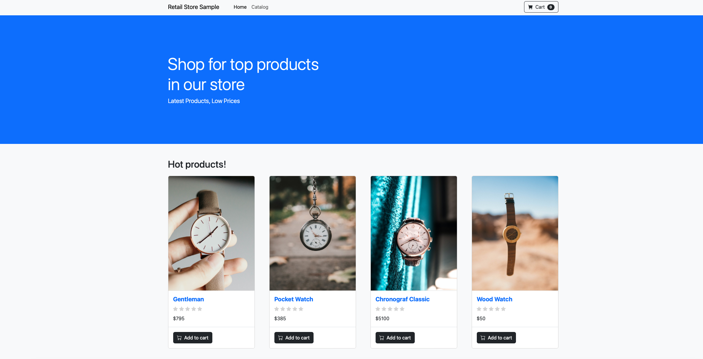

# Lab 0 - Initial Setup

## Verify Lab environment
1. Navigate into the ../terraform directory and use `terraform output` command to generate the state outputs for these workshop. We will use and refer them throughout the workshop process. This is a sample output:
```bash
Outputs:

cluster_peer_destenation = "cluster peer create -address-family ipv4 -peer-addrs 10.0.1.139,10.0.1.232"
cluster_peer_source = "cluster peer create -address-family ipv4 -peer-addrs 10.1.1.10,10.1.1.136"
fsx-dr-management-ip = toset([
  "10.1.1.92",
])
fsx-management-ip = toset([
  "10.0.1.126",
])
fsx-ontap-id = "fs-013b852f46d03ab97"
fsx-password = <fsx-password>
fsx-svm-name = "ekssvm"
fsx-svmdr-name = "ekssvmdr"
fsx2-ontap-id = "fs-0c2fcb7709de5be8e"
region = <region>
secret_arn = "arn:aws:secretsmanager:<region>:<account-id>:secret:fsxn-password-secret-SJcLlRXx-yY0pCt"
svm_peer_destination = "vserver peer create -vserver ekssvmdr -peer-vserver ekssvm -peer-cluster FsxId013b852f46d03ab97 -applications snapmirror"
svm_peer_source = "vserver peer accept -vserver ekssvm -peer-vserver ekssvmdr"
zz_update_kubeconfig_command = "aws eks update-kubeconfig --name eks-saas-SJcLlRXx --region us-east-1"
zz_update_kubeconfig_command2 = "aws eks update-kubeconfig --name eks-saas-dr-SJcLlRXx --region us-east-1"
```

2. Update your local kubeconfig file to connect with the EKS production cluter using the command on the `zz_update_kubeconfig_command` (terrafor output)

3. Check sample application is running on `tenant0` on the production cluster:
```bash
❯ kubectl get pods -n tenant0
NAME                              READY   STATUS    RESTARTS        AGE
assets-6694b7ccff-gb52h           1/1     Running   0               4d19h
carts-8c454c85c-zlb8p             1/1     Running   0               4d19h
carts-dynamodb-57dc7d97d5-pxjwq   1/1     Running   0               4d19h
catalog-6ffdd78f77-hfvcf          1/1     Running   4 (4d19h ago)   4d19h
catalog-mysql-0                   1/1     Running   0               4d19h
checkout-8b8548dd8-cdg87          1/1     Running   0               4d19h
checkout-redis-78f4d66577-9gzsx   1/1     Running   0               4d19h
orders-6574497d84-d5l6c           1/1     Running   2 (4d19h ago)   4d19h
orders-mysql-0                    1/1     Running   0               4d19h
orders-rabbitmq-0                 1/1     Running   0               4d19h
ui-774d676c59-cbjqx               1/1     Running   0               4d19h
```

4. Check that stateful application PVCs are all allocated successfully:
```bash
❯ kubectl get pvc -n tenant0
NAME                     STATUS   VOLUME                                     CAPACITY   ACCESS MODES   STORAGECLASS      VOLUMEATTRIBUTESCLASS   AGE
assets-share             Bound    pvc-da599f54-b473-496c-bb45-906aefd0d898   5Gi        RWX            trident-csi-nas   <unset>                 4d19h
data-catalog-mysql-0     Bound    pvc-df3f9b0e-5fc2-42c2-9770-3806924a11e6   30Gi       RWO            trident-csi-san   <unset>                 4d19h
data-orders-mysql-0      Bound    pvc-a82e2871-a0be-4de5-bf9a-b590316ec1a3   30Gi       RWO            trident-csi-san   <unset>                 4d19h
data-orders-rabbitmq-0   Bound    pvc-905f5138-b85d-4893-9811-790e6e118620   30Gi       RWO            trident-csi-san   <unset>                 4d19h
```

5. Retrieve the sample application UI load-balancer address:
```
❯ kubectl get svc -n tenant0 ui
NAME   TYPE           CLUSTER-IP      EXTERNAL-IP                                                          PORT(S)        AGE
ui     LoadBalancer   172.20.254.36   saas-fsxn-workshop-ui-de66fe501cfbfd0a.elb.us-east-1.amazonaws.com   80:30278/TCP   70m
```

6. Try to login to the sample application from the web browser:

