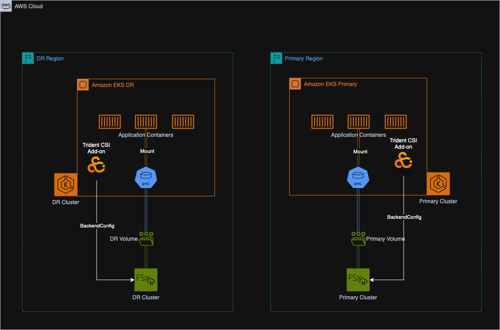

## Infrastructure Overview
Out EKS clusters, FSxN clusters and all netwroking parts (VPCs, Subnets, NAT Gateways etc.) you see in the diagram below were all installed in Lab 0. 

---
Below is a (non-exhaustive) list of artifacts that were deployed for your use in this lab:

| Name | Type | Purpose |
|------|------|---------|
| eks-saas | EKS Cluster | Run production application workload |
| eks-saas-dr | EKS Cluster | Run DR applications workloads |
| eksfs | FSxN Cluster | Storage backend for production applications |
| eksfsdr | FSxN Cluster | Storage backend for DR applications |

