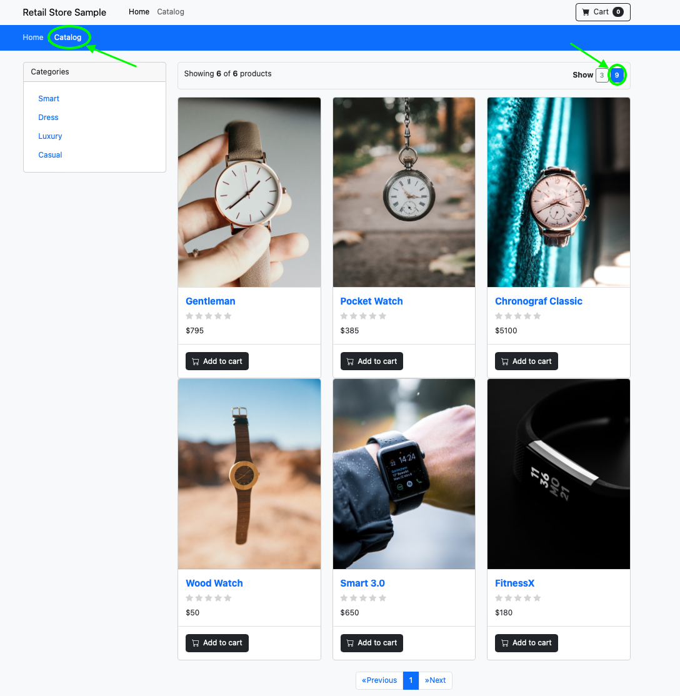

# Lab 2 - Data Protection
Locally protect and recover your users’ data by using advanced backup and restore capabilities, that can be as granular as a file, tenant, or an entire application. 

## Task 1 
Use NetApp Snapshots to recover an entire volume 

Task objective: Use NetApp Snapshots to recover a volume 

**Step 0:**: Check product catalog in tenant0 sample application by logging into the web ui and selecting the product catalog. You should see 6 items available at the catalog.




**Step 1:**: Create `VolumeSnapshotClass` for `tenant0`. Use [volume-snapshot-class.yaml](volume-snapshot-class.yaml) manifset to create a VolumeSnapshotClass:
```
kubectl create -n tenant0 -f volume-snapshot-class.yaml
```
Expected output:
```
volumesnapshotclass.snapshot.storage.k8s.io/fsx-snapclass created
```

**Step 2:** Create `VolumeSnapshot` on both the catalog DB volume and the assets images volume. Use [volume-snapshot.yaml](volume-snapshot.yaml) to create the snapshots:
```
kubectl create -n tenant0 -f volume-snapshot.yaml
```
Expected output:
```
volumesnapshot.snapshot.storage.k8s.io/data-catalog-mysql-0-snap created
volumesnapshot.snapshot.storage.k8s.io/assets-share created
```

**Step 3:** Run the followin to verify the `VolumeSnapshot`s:
```
kubectl get vs -n tenant0
```
Expected output:
```
NAME                        READYTOUSE   SOURCEPVC              SOURCESNAPSHOTCONTENT   RESTORESIZE   SNAPSHOTCLASS   SNAPSHOTCONTENT                                    CREATIONTIME   AGE
assets-share                true         assets-share                                   324Ki         fsx-snapclass   snapcontent-5417f976-7504-49bc-a204-70dc63cd3d5f   29s            30s
data-catalog-mysql-0-snap   true         data-catalog-mysql-0                           30Gi          fsx-snapclass   snapcontent-48a6e942-b2fd-4fca-aa75-4c4d69e91f0e   30s            30s
```
**Step 4:** Update application with new item in catalog DB volume and new image on NFS assets images volume.
1) Log in to the Catalog MySQL server:
```
❯ kubectl exec -it catalog-mysql-0 -n tenant0 -- mysql -u root -pmy-secret-pw
```
Expected output:
```
mysql: [Warning] Using a password on the command line interface can be insecure.
Welcome to the MySQL monitor.  Commands end with ; or \g.
Your MySQL connection id is 13
Server version: 5.7.44 MySQL Community Server (GPL)

Copyright (c) 2000, 2023, Oracle and/or its affiliates.

Oracle is a registered trademark of Oracle Corporation and/or its
affiliates. Other names may be trademarks of their respective
owners.

Type 'help;' or '\h' for help. Type '\c' to clear the current input statement.
```
2) Add a new product to the catalog:
```
mysql> use catalog
Reading table information for completion of table and column names
You can turn off this feature to get a quicker startup with -A

Database changed

mysql> select * from product;
+--------------------------------------+--------------------+------------------------------------------+-------+-------+----------------------------+
| product_id                           | name               | description                              | price | count | image_url                  |
+--------------------------------------+--------------------+------------------------------------------+-------+-------+----------------------------+
| 510a0d7e-8e83-4193-b483-e27e09ddc34d | Gentleman          | Touch of class for a bargain.            |   795 |    51 | /assets/gentleman.jpg      |
| 6d62d909-f957-430e-8689-b5129c0bb75e | Pocket Watch       | Properly dapper.                         |   385 |    33 | /assets/pocket_watch.jpg   |
| 808a2de1-1aaa-4c25-a9b9-6612e8f29a38 | Chronograf Classic | Spend that IPO money                     |  5100 |     9 | /assets/chrono_classic.jpg |
| a0a4f044-b040-410d-8ead-4de0446aec7e | Wood Watch         | Looks like a tree                        |    50 |   115 | /assets/wood_watch.jpg     |
| ee3715be-b4ba-11ea-b3de-0242ac130004 | Smart 3.0          | Can tell you what you want for breakfast |   650 |     9 | /assets/smart_1.jpg        |
| f4ebd070-b4ba-11ea-b3de-0242ac130004 | FitnessX           | Touch of class for a bargain.            |   180 |    76 | /assets/smart_2.jpg        |
+--------------------------------------+--------------------+------------------------------------------+-------+-------+----------------------------+
6 rows in set (0.00 sec)

mysql> INSERT INTO product VALUES ("f4ebd070-b4ba-11ea-b3de-4de0446aec7e", "Cuckoo clock", "Great for bird lovers.",  550, 3, "/assets/cuckoo.jpg");
Query OK, 1 row affected (0.00 sec)

mysql> INSERT INTO product_tag VALUES ("f4ebd070-b4ba-11ea-b3de-4de0446aec7e", "1");
Query OK, 1 row affected (0.00 sec)

mysql> select * from product;
+--------------------------------------+--------------------+------------------------------------------+-------+-------+----------------------------+
| product_id                           | name               | description                              | price | count | image_url                  |
+--------------------------------------+--------------------+------------------------------------------+-------+-------+----------------------------+
| 510a0d7e-8e83-4193-b483-e27e09ddc34d | Gentleman          | Touch of class for a bargain.            |   795 |    51 | /assets/gentleman.jpg      |
| 6d62d909-f957-430e-8689-b5129c0bb75e | Pocket Watch       | Properly dapper.                         |   385 |    33 | /assets/pocket_watch.jpg   |
| 808a2de1-1aaa-4c25-a9b9-6612e8f29a38 | Chronograf Classic | Spend that IPO money                     |  5100 |     9 | /assets/chrono_classic.jpg |
| a0a4f044-b040-410d-8ead-4de0446aec7e | Wood Watch         | Looks like a tree                        |    50 |   115 | /assets/wood_watch.jpg     |
| ee3715be-b4ba-11ea-b3de-0242ac130004 | Smart 3.0          | Can tell you what you want for breakfast |   650 |     9 | /assets/smart_1.jpg        |
| f4ebd070-b4ba-11ea-b3de-0242ac130004 | FitnessX           | Touch of class for a bargain.            |   180 |    76 | /assets/smart_2.jpg        |
| f4ebd070-b4ba-11ea-b3de-4de0446aec7e | Cuckoo clock       | Great for bird lovers.                   |   550 |     3 | /assets/cuckoo.jpg         |
+--------------------------------------+--------------------+------------------------------------------+-------+-------+----------------------------+
7 rows in set (0.00 sec)

mysql> exit
Bye
```
3) Add new product image to the assets store:
```
kubectl exec --stdin deployment/assets -n tenant0 -- bash -c 'curl https://upload.wikimedia.org/wikipedia/commons/f/fc/Du200613.png -o /usr/share/nginx/html/assets/cuckoo.jpg'
```
Expected output:
```
  % Total    % Received % Xferd  Average Speed   Time    Time     Time  Current
                                 Dload  Upload   Total   Spent    Left  Speed
100  116k  100  116k    0     0   887k      0 --:--:-- --:--:-- --:--:--  890k

kubectl exec -n tenant0 --stdin deployment/assets -- bash -c 'ls /usr/share/nginx/html/assets'

chrono_classic.jpg
cuckoo.jpg
gentleman.jpg
pocket_watch.jpg
smart_1.jpg
smart_2.jpg
wood_watch.jpg
```

4) Log in to tenant0 web ui and check the store catalog. You should now see 7 items in the catalog. 


5) Select the new item in the catalog and check it out:


**Step 5:** Restore from Snapshot
1) Scale down the number of active pods shutdown the assets service:
```
kubectl scale deploy assets -n tenant0 --replicas=0
deployment.apps/assets scaled
```
2) Check number of Pods in service is zero:
```
kubectl get deploy assets -n tenant0
NAME             READY   UP-TO-DATE   AVAILABLE   AGE
assets           0/0     0            0           28h
```

3) Scale down the number of active pods shutdown the catalog mysql service:
```
kubectl scale statefulset catalog-mysql -n tenant0 --replicas=0
statefulset.apps/catalog-mysql scaled
```

> **IMPORTANT**: In some cases the PVC of the statefulset doesn't release the VolumeAttachment from the node. Please verify it does by using `kubectl get volumeattachment -n tenant0`. If the attachment of the relevant PV is there use this command to remove it `kubectl delete volumeattachment <attachment-id> -n tenant0`

4) Check number of Pods in service is zero:
```
kubectl get statefulset catalog-mysql -n tenant0
NAME            READY   AGE
catalog-mysql   0/0     28h
```

5) Run restore in place using [snap-restore.yaml](snap-restore.yaml)
```
kubectl create -f snap-restore.yaml
tridentactionsnapshotrestore.trident.netapp.io/assets-share created
tridentactionsnapshotrestore.trident.netapp.io/data-catalog-mysql-0 created
```

6) Restart the assets pods:
```
kubectl scale deploy assets -n tenant0 --replicas=1

deployment.apps/assets scaled
```

7) Restart the catalog mysql db pods:
```
> kubectl scale statefulset catalog-mysql -n tenant0 --replicas=1
statefulset.apps/catalog-mysql scaled
```
**Step 6:** Verify the restored application
1) Check the assets service volume content. You should see 6 images as it was before the images download:
```
kubectl exec -n tenant0 --stdin deployment/assets -- bash -c 'ls /usr/share/nginx/html/assets'

chrono_classic.jpg
gentleman.jpg
pocket_watch.jpg
smart_1.jpg
smart_2.jpg
wood_watch.jpg
```

2) Log in to the Catalog MySQL server:
```
❯ kubectl exec -it catalog-mysql-0 -n tenant0 -- mysql -u root -pmy-secret-pw

mysql: [Warning] Using a password on the command line interface can be insecure.
Welcome to the MySQL monitor.  Commands end with ; or \g.
Your MySQL connection id is 13
Server version: 5.7.44 MySQL Community Server (GPL)

Copyright (c) 2000, 2023, Oracle and/or its affiliates.

Oracle is a registered trademark of Oracle Corporation and/or its
affiliates. Other names may be trademarks of their respective
owners.

Type 'help;' or '\h' for help. Type '\c' to clear the current input statement.
```

3) Check the products in the catalog:
```
mysql> use catalog
Reading table information for completion of table and column names
You can turn off this feature to get a quicker startup with -A

Database changed

mysql> select * from product;
+--------------------------------------+--------------------+------------------------------------------+-------+-------+----------------------------+
| product_id                           | name               | description                              | price | count | image_url                  |
+--------------------------------------+--------------------+------------------------------------------+-------+-------+----------------------------+
| 510a0d7e-8e83-4193-b483-e27e09ddc34d | Gentleman          | Touch of class for a bargain.            |   795 |    51 | /assets/gentleman.jpg      |
| 6d62d909-f957-430e-8689-b5129c0bb75e | Pocket Watch       | Properly dapper.                         |   385 |    33 | /assets/pocket_watch.jpg   |
| 808a2de1-1aaa-4c25-a9b9-6612e8f29a38 | Chronograf Classic | Spend that IPO money                     |  5100 |     9 | /assets/chrono_classic.jpg |
| a0a4f044-b040-410d-8ead-4de0446aec7e | Wood Watch         | Looks like a tree                        |    50 |   115 | /assets/wood_watch.jpg     |
| ee3715be-b4ba-11ea-b3de-0242ac130004 | Smart 3.0          | Can tell you what you want for breakfast |   650 |     9 | /assets/smart_1.jpg        |
| f4ebd070-b4ba-11ea-b3de-0242ac130004 | FitnessX           | Touch of class for a bargain.            |   180 |    76 | /assets/smart_2.jpg        |
+--------------------------------------+--------------------+------------------------------------------+-------+-------+----------------------------+
6 rows in set (0.00 sec)

mysql> exit
Bye
```

4) Check product catalog in tenant0 sample application by logging into the web ui and selecting the product catalog. After the restore you should now see the original 6 items available at the catalog.

