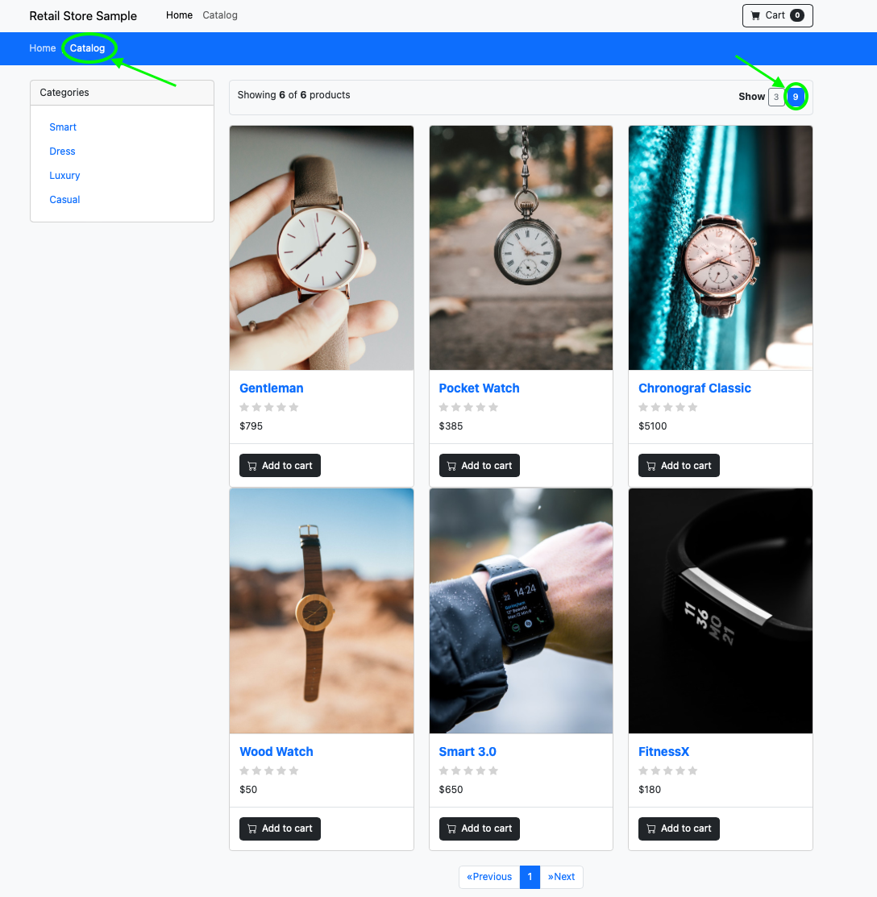

## Lab 2 - Data Protection
Locally protect and recover your users’ data by using advanced backup and restore capabilities, that can be as granular as a file, tenant, or an entire application. 

In this lab we'll use NetApp Trident and FSxN CSI Snapshots to backup and restore out sample application product catalog service. 

### Step 0 - Check product catalog
Check the product catalog of tenant0 sample application by logging into the web ui and selecting the product catalog. You should see 6 items available at the catalog.

