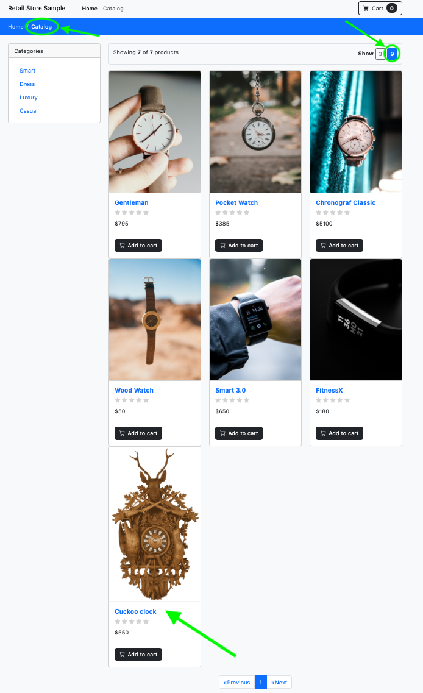

## Validate the catalog after updates
Next we'll verify the item we added to the catalog and assets services.
### Step 5 - Check additionl item in the product catalog
List the new image we added to the assets file share
```shell
kubectl exec -n tenant0 --stdin deployment/assets -- bash -c 'ls /usr/share/nginx/html/assets'
```
Expected output:
```shell
chrono_classic.jpg
cuckoo.jpg
gentleman.jpg
pocket_watch.jpg
smart_1.jpg
smart_2.jpg
wood_watch.jpg
```

Log in to tenant0 web ui and check the store catalog. You should now see 7 items in the catalog. 



Select the new item in the catalog and check it out:

